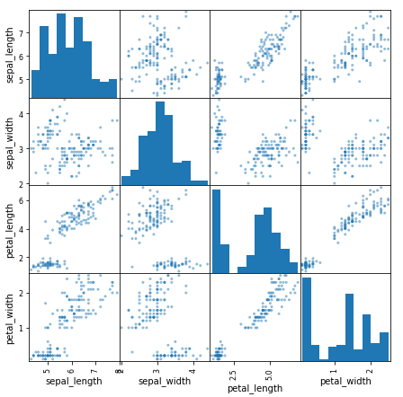

# Python plotting utilities: `plot_utils`
This is a Python module that contains some useful plotting utilities. Current functionalities include:

+ **3D histograms**: visualizing multiple distributions easily and elegantly [[doc](./docs/histogram3d.md)], [[example](./examples/3D_histograms_example.ipynb)]
+ **Discrete histogram**, suitable for visualizing categorical values [[doc](./docs/discrete_histogram.md)], [[example](./examples/Discrete_histogram_example.ipynb)]
+ **Choropleth map** (aka "heat map") of the United States, on both state and county level [[doc](./docs/choropleth_map.md)], [[example](./examples/Choropleth_map_example.ipynb)]
+ **Correlation matrix** (aka "covariance matrix") of a dataset [[doc](./docs/plot_correlation.md)], [[example](./examples/Correlation_matrix_examples.ipynb)]
  + and the one-to-one **scatter plots** for the variables within the dataset [[doc](./docs/scatter_plots_two_cols.md)]
+ **"Bin-and-mean" plot**, a good way to uncover the dependency between two variables [[doc](./docs/bin_and_mean.md)], [[example](./examples/Bin-and-mean_example.ipynb)]
+ **Pie chart** to visualize proportions, more convenient than matplotlib's `pie()` function [[doc](./docs/piechart.md)], [[example](./examples/Pie_chart_example.ipynb)]
+ **Time series plotting**, for visualizing single or multiple time series data quickly and elegantly [[doc](./docs/plot_timeseries.md)], [[example](./examples/Plot_time_series_example.ipynb)]
+ **Plotting with upper/lower error bounds**, which displays error bounds as shaded areas [[doc](./docs/plot_with_error_bounds.md)], [[example](./examples/Plot_with_error_bounds_example.ipynb)]


## Gallery

### 1. Three-dimensional histograms

```{python}
>>> import plot_utils as pu
>>> pu.histogram3d(X)  # X is the dataset to be visualized
```

The function `pu.histogram3d()` takes your data and automatically displays nice 3D histograms. You can adjust the angle of view, transparency, etc., by yourself.

[[doc](./docs/histogram3d.md)], [[example](./examples/3D_histograms_example.ipynb)]


### 2. Choropleth map (state level)

```python
>>> import plot_utils as pu
>>> pu.choropleth_map_state(state_level_data)
```

You can organize your own state-specific data into a Python dictionary or Pandas Series/DataFrame, and `pu.choropleth_map_state()` can plot a nice choropleth map as shown below.

[[doc](./docs/choropleth_map.md)], [[example](./examples/Choropleth_map_example.ipynb)]


### 3. Choropleth map (county level)

```{python}
>>> import plot_utils as pu
>>> pu.choropleth_map_county(county_level_data)
```

Similarly to above, another function called `pu.choropleth_map_county()` plots county-level numerical data as a choropleth map.

[[doc](./docs/choropleth_map.md#plot_utilschoropleth_map_county)], [[example](./examples/Choropleth_map_example.ipynb)]


### 4. Correlation matrix (aka, covariance matrix)

Generates a plot of the correlation matrix of a dataset, `X`. Also generates scatter plots of variables with high correlations (absolute value >= 0.7).

```python
>>> import plot_utils as pu
>>> pu.plot_correlation(X, scatter_plots=True)
```

[[doc](./docs/plot_correlation.md)], [[example](./examples/Correlation_matrix_examples.ipynb)]





### 5. "Bin-and-mean" plot

```python
>>> import plot_utils as pu
>>> pu.bin_and_mean(x, y, logx=True,
         xlabel='Maximum strain [%]',ylabel='Goodness-of-fit scores')
```

[[doc](./docs/bin_and_mean.md)], [[example](./examples/Bin-and-mean_example.ipynb)]


### 6. Pie chart
```Python
>>> import plot_utils as pu
>>> pu.piechart(iris['species'])  # plots single time series
```

[[doc](./docs/piechart.md)], [[example](./examples/Pie_chart_example.ipynb)] 


### 7. Time series plotting

```Python
>>> import plot_utils as pu
>>> pu.plot_time_series(x)  # plots single time series
>>> pu.plot_multiple_timeseries(X)  # plots more than one time series
```

`pu.plot_multiple_timeseries()` generates plots multiple time series on the same plot nicely.

[[doc](./docs/plot_timeseries.md)], [[example](./examples/Plot_time_series_example.ipynb)]


### 8. Plot with error bounds

```{python}
>>> import plot_utils as pu
>>> pu.plot_with_error_bounds(data,upper_bound,lower_bound)
```

`pu.plot_with_error_bounds()` plots data and the associating error bounds on the same graph.

[[doc](./docs/plot_with_error_bounds.md)], [[example](./examples/Plot_with_error_bounds_example.ipynb)]


## Installation

No installation required.

Just download this repository, and you can put `plot_utils.py` anywhere within your Python search path.


## Dependencies

+ Python 2.7 or 3.5 or 3.6
+ matplotlib 1.5.0+, or 2.0.0+ (Version 2.1.0 is strongly recommended.)
+ numpy: 1.11.0+
+ pandas: 0.20.0+
+ matplotlib/basemap: 1.0.7 (only if you want to plot the two choropleth maps)


## Aesthetics

The aesthetics of of the `plot_utils` module are matplotlib-styled by default, but it doesn't mean that you can't use your favorite styles in seaborn or ggplot2.

Unlike some plotting packages that enforces their own styles and restrict users from customizing, users of this module can adjust the figure styles freely: either from within matplotlib (https://matplotlib.org/devdocs/gallery/style_sheets/style_sheets_reference.html), or `import seaborn` and let seaborn take care of everything.


## References

I did not built every function of this module entirely from scratch. I documented the sources that I referenced in the documentation of the corresponding functions.


## Copyright and license

(c) 2017, Jian Shi

License: GPL v3.0