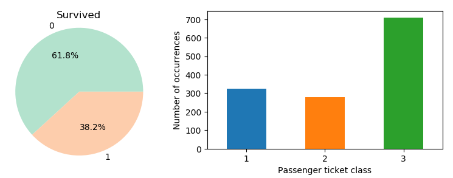
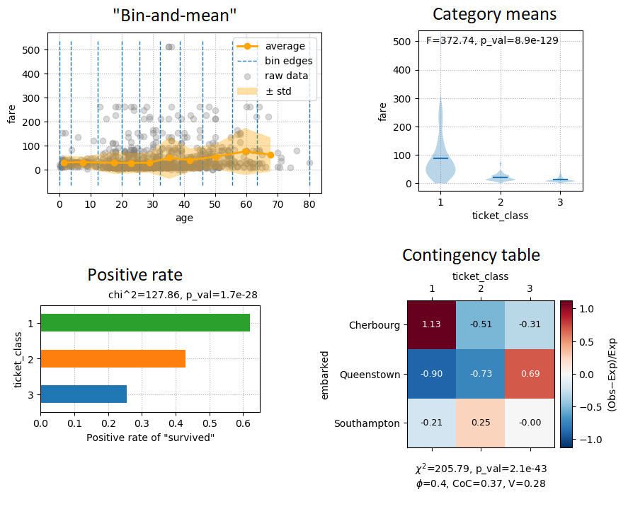
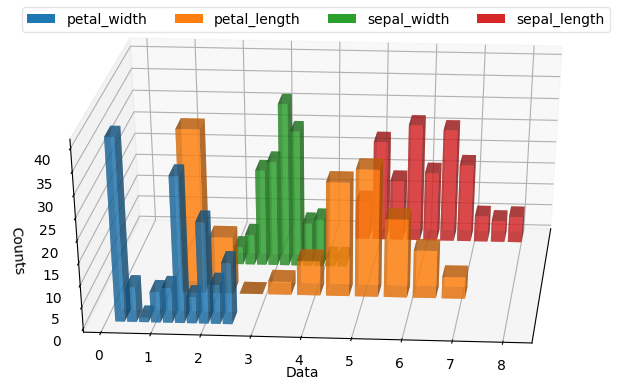
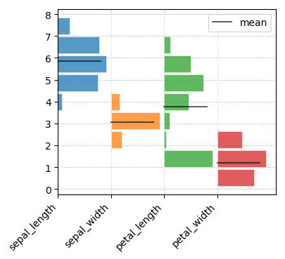
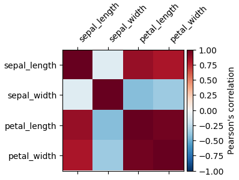
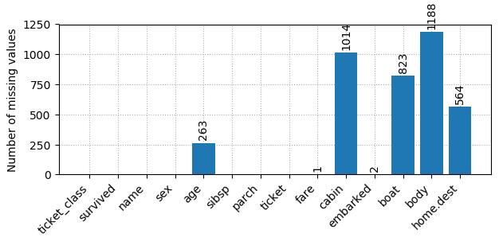
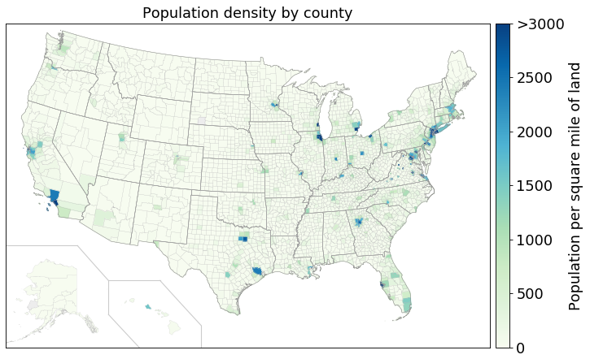
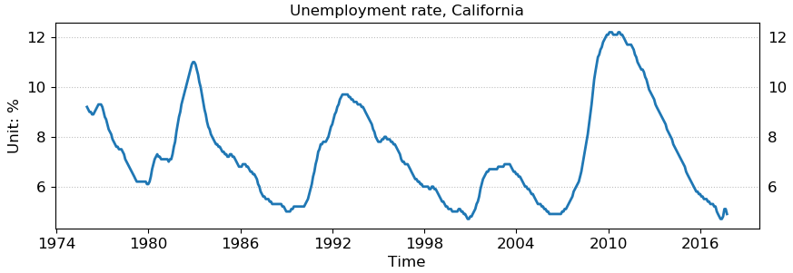
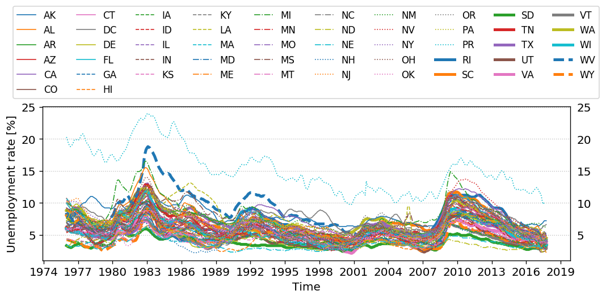
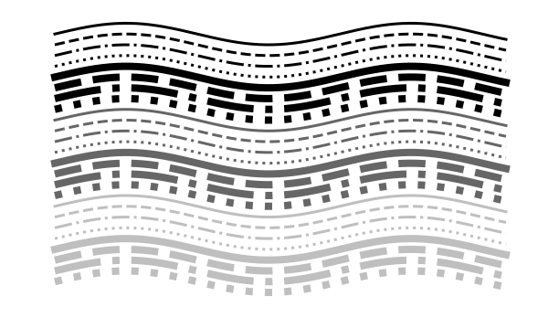

# Python plotting utilities: `plot_utils`

This is a Python module that contains some useful data visualization tools.

## Table of contents

   * [Installation](#installation)
   * [API documentations](#api-documentations)
   * [Current functionalities](#current-functionalities)
   * [Gallery](#gallery)
       - [One column of data](#1-one-column-of-data)
       - [Two columns of data](#2-two-columns-of-data)
       - [Multiple columns of data](#3-multiple-columns-of-data)
       - [Choropleth maps (a.k.a., "heat maps")](#4-choropleth-maps-aka-heat-maps)
       - [Time series plotting](#5-time-series-plotting-1)
       - [Miscellaneous](#6-miscellaneous-1)
   * [Dependencies](#dependencies)
   * [Testing](#testing)
   * [Aesthetics](#aesthetics)
   * [References](#references)
   * [Copyright and license](#copyright-and-license)


## Installation

In a command-line terminal, execute the following command:

`pip install git+https://github.com/jsh9/python-plot-utilities@v0.5.3`

##### Note:

If you run into the following issue on Mac OS X (or macOS) when importing `plot_utils`:

`RuntimeError: Python is not installed as a framework. The Mac OS X backend will not be able to function correctly if Python is not installed as a framework.`

please follow this solution to fix the issue: https://stackoverflow.com/a/21789908/8892243


## API documentations

All API documentations are on: https://python-plot-utilities.readthedocs.io/en/stable/index.html.


## Current functionalities

Current functionalities include (for full list, use `print(plot_utils.__doc__)`):

#### 1. Visualizing one column of data

- **Pie chart**: proportions of distinct values in an array, more convenient than matplotlib's `pie()` function [[doc](https://python-plot-utilities.readthedocs.io/en/stable/api_docs/pie_chart.html)], [[example](./examples/Pie_chart_example.ipynb)]
- **Discrete histogram**: counts of distinct values in an array [[doc](https://python-plot-utilities.readthedocs.io/en/stable/api_docs/discrete_histogram.html)], [[example](./examples/Discrete_histogram_example.ipynb)]

#### 2. Visualizing two columns of data ([[example](./examples/Two_columns_of_data_example.ipynb)])

- **"Bin-and-mean" plot**: for two continuous variables [[doc](https://python-plot-utilities.readthedocs.io/en/stable/api_docs/bin_and_mean.html)]
- **Category mean**: for a categorical variable and a continuous variable [[doc](https://python-plot-utilities.readthedocs.io/en/stable/api_docs/category_means.html)]
- **Positive rate**: for a categorical variable and a binary categorical variable [[doc](https://python-plot-utilities.readthedocs.io/en/stable/api_docs/positive_rate.html)]
- **Contingency table**: for two categorical variables [[doc](https://python-plot-utilities.readthedocs.io/en/stable/api_docs/contingency_table.html)]

#### 3. Visualizing multiple columns of data

+ **3D histograms**: distributions of multiple variables [[doc](https://python-plot-utilities.readthedocs.io/en/stable/api_docs/3d_histograms.html)], [[example](./examples/3D_histograms_example.ipynb)]
+ **Multiple histograms**: distribution of multiple variables [[doc](https://python-plot-utilities.readthedocs.io/en/stable/api_docs/hist_multi.html)], [[example](./examples/Violin_plot_and_hist_multi_example.ipynb)]
+ **Violin plot**: distribution of multiple variables [[doc](https://python-plot-utilities.readthedocs.io/en/stable/api_docs/violin_plot.html)], [[example](./examples/Violin_plot_and_hist_multi_example.ipynb)]
+ **Correlation matrix**: correlation between each columns of a dataset [[doc](https://python-plot-utilities.readthedocs.io/en/stable/api_docs/correlation_matrix.html)], [[example](./examples/Correlation_matrix_examples.ipynb)]
    - and the one-to-one **scatter plots** for the variables within the dataset [[doc](https://python-plot-utilities.readthedocs.io/en/stable/api_docs/scatter_plot_two_cols.html)]
+ **Count missing values**: how many missing values are there in each column of the dataset [[doc](https://python-plot-utilities.readthedocs.io/en/stable/api_docs/missing_values.html)], [[example](./examples/Missing_value_count_example.ipynb)]


#### 4. Map plotting

+ **Choropleth map** (a.k.a., "heat map") of the United States, on both the state and county level [[doc](https://python-plot-utilities.readthedocs.io/en/stable/api_docs/choropleth_map.html)], [[example](./examples/Choropleth_map_example.ipynb)]


#### 5. Time series plotting

- **Plot single time series**: [[doc](https://python-plot-utilities.readthedocs.io/en/stable/api_docs/plot_time_series.html)], [[example](./examples/Plot_time_series_example.ipynb)]
- **Plot multiple time series**: [[doc](https://python-plot-utilities.readthedocs.io/en/stable/api_docs/plot_multiple_timeseries.html)], [[example](./examples/Plot_time_series_example.ipynb)]
- **Fill time series with error bounds**: [[doc](https://python-plot-utilities.readthedocs.io/en/stable/api_docs/fill_timeseries.html)], [[example](./examples/Plot_time_series_example.ipynb)]

#### 6. Miscellaneous

+ A **get_colors()** function that conveniently queries different color palettes [[doc](https://python-plot-utilities.readthedocs.io/en/stable/api_docs/get_colors.html)], [[example](./examples/Color_and_linespec_examples.ipynb)]
+ A **get_linespecs()** function that generates distinct color/linestyle/linewidth combinations for plotting many lines together [[doc](https://python-plot-utilities.readthedocs.io/en/stable/api_docs/get_linespecs.html)], [[example](./examples/Color_and_linespec_examples.ipynb)]
+ Two helper classes: **Color** and **Multiple_Colors**, which make querying and displaying colors more easily  [[doc](https://python-plot-utilities.readthedocs.io/en/stable/api_docs/color_classes.html)], [[example](./examples/Color_and_linespec_examples.ipynb)]
+ **Plotting with error bounds**, which displays error bounds as shaded areas [[doc](https://python-plot-utilities.readthedocs.io/en/stable/api_docs/plot_with_bounds.html)], [[example](./examples/Plot_with_error_bounds_example.ipynb)]
+ **trim_img()**, which trims the white margins of the specified image file(s) [[doc](https://python-plot-utilities.readthedocs.io/en/stable/api_docs/trim_image.html)]
+ **pad_img()**, which pads image(s) with margins so that they meet a specified aspect ratio [[doc](https://python-plot-utilities.readthedocs.io/en/stable/api_docs/pad_image.html)]
+ **plot_ranking()**, which ranks a series of values and shows them as a bar chart [[doc](https://python-plot-utilities.readthedocs.io/en/stable/api_docs/plot_ranking.html)], [[example](./examples/Plot_ranking_example.ipynb)]


## Gallery

### 1. One column of data

Using the "Titanic dataset" as example:

```python
import pandas as pd
import plot_utils as pu
titanic = pd.read_csv('./examples/datasets/titanic3.csv')
pu.piechart(titanic['survived'], title='Suvived')
pu.discrete_histogram(titanic['pclass'], xlabel='Passenger ticket class')
```

Piechart: [[doc](https://python-plot-utilities.readthedocs.io/en/stable/api_docs/pie_chart.html)], [[example](./examples/Pie_chart_example.ipynb)]

Discrete histogram: [[doc](https://python-plot-utilities.readthedocs.io/en/stable/api_docs/discrete_histogram.html)], [[example](./examples/Discrete_histogram_example.ipynb)]




### 2. Two columns of data

Using the "Titanic dataset" as example:

```python
titanic = pd.read_csv('./examples/datasets/titanic3.csv')
titanic.rename(index=str, columns={'pclass':'ticket_class'}, inplace=True)
titanic['embarked'] = titanic['embarked'].map({'S':'Southampton',
                                               'C':'Cherbourg',
                                               'Q':'Queenstown'})

pu.bin_and_mean(titanic['age'], titanic['fare'], figsize=(5,3))
pu.category_means(titanic['ticket_class'], titanic['fare'])
pu.positive_rate(titanic['ticket_class'], titanic['survived'], figsize=(5,2))
pu.contingency_table(titanic['ticket_class'], titanic['embarked'], dropna=True, rot=0)
```

[["bin-and-mean" doc](https://python-plot-utilities.readthedocs.io/en/stable/api_docs/bin_and_mean.html)]
[["category means" doc](https://python-plot-utilities.readthedocs.io/en/stable/api_docs/category_means.html)]
[["positive rate" doc](https://python-plot-utilities.readthedocs.io/en/stable/api_docs/positive_rate.html)]
[["contingency table" doc](https://python-plot-utilities.readthedocs.io/en/stable/api_docs/contingency_table.html)]
[[All examples](./examples/Two_columns_of_data_example.ipynb)]




### 3. Multiple columns of data

#### 3.1. 3D histograms

Useful for comparing multiple distributions:

```python
iris = pd.read_csv('./examples/datasets/iris.csv')
pu.histogram3d(iris[['petal_width', 'petal_length', 'sepal_width', 'sepal_length']])
```

[[doc](https://python-plot-utilities.readthedocs.io/en/stable/api_docs/3d_histograms.html)], [[example](./examples/3D_histograms_example.ipynb)]




#### 3.2. Multi-histogram plots

Another useful tool to compare multiple distributions:

```python
pu.hist_multi(iris[['sepal_length', 'sepal_width', 'petal_length', 'petal_width']]);
```

[[doc](https://python-plot-utilities.readthedocs.io/en/stable/api_docs/hist_multi.html)], [[example](./examples/Violin_plot_example.ipynb)]



#### 3.3. Violin plots

To compare multiple distributions:

```python
pu.violin_plot(iris[['petal_width', 'petal_length', 'sepal_width', 'sepal_length']])
```

[[doc](https://python-plot-utilities.readthedocs.io/en/stable/api_docs/violin_plot.html)], [[example](./examples/Violin_plot_example.ipynb)]


#### 3.4. Correlation matrix

```python
iris = pd.read_csv('./examples/datasets/iris.csv')
pu.plot_correlation(iris, scatter_plots=True)
```

The first figure shows the correlation (or "sample covariance")  between each column. The second figure shows the scatter plots between each pair of columns.

[[doc](https://python-plot-utilities.readthedocs.io/en/stable/api_docs/correlation_matrix.html)], [[example](./examples/Correlation_matrix_examples.ipynb)]




#### 3.5. Count missing values

To see how much data is missing in each column of a data set:

```python
titanic = pd.read_csv('./examples/datasets/titanic3.csv')
pu.missing_value_counts(titanic)
```

[[doc](https://python-plot-utilities.readthedocs.io/en/stable/api_docs/missing_values.html)], [[example](./examples/Missing_value_count_example.ipynb)]

Each bar corresponds to a column in `titanic`, and the numbers atop are the missing data counts for the corresponding column.




### 4. Choropleth maps (a.k.a., "heat maps")

#### 4.1. State-level choropleth maps for the US

```python
pu.choropleth_map_state(state_level_data)  # `state_level_data`: dict, pandas.DataFrame, or pandas.Series
```

[[doc](https://python-plot-utilities.readthedocs.io/en/stable/api_docs/choropleth_map.html)], [[example](./examples/Choropleth_map_example.ipynb)]


#### 4.2. County-level choropleth maps for the US

```python
pu.choropleth_map_county(county_level_data)  # `county_level_data`: dict, pandas.DataFrame, or pandas.Series
```

[[doc](https://python-plot-utilities.readthedocs.io/en/stable/api_docs/choropleth_map.html)], [[example](./examples/Choropleth_map_example.ipynb)]




### 5. Time series plotting

#### 5.1. Single time series

```python
df = pd.read_csv('./examples/datasets/Unemployment_rate_1976-2017.csv', index_col=0)
pu.plot_timeseries(df['CA'], ylabel='Unit: %', title='Unemployment rate, California')
```

[[doc](https://python-plot-utilities.readthedocs.io/en/stable/api_docs/plot_time_series.html)], [[example](./examples/Plot_time_series_example.ipynb)]



#### 5.2. Multiple time series

```python
pu.plot_multiple_timeseries(df, ylabel='Unemployment rate [%]', ncol_legend=10)
```

[[doc](https://python-plot-utilities.readthedocs.io/en/stable/api_docs/plot_multiple_timeseries.html)], [[example](./examples/Plot_time_series_example.ipynb)]




### 6. Miscellaneous

#### 6.1. `get_colors()` function

Easy querying of distinguishable color palettes.

```python
colors = pu.get_colors(color_scheme='tab10', N=10)  # `colors`: a list containing 10 colors
pu.Multiple_Colors(colors).show()  # show colors as a palette
```

[[doc](https://python-plot-utilities.readthedocs.io/en/stable/api_docs/get_colors.html)], [[example](./examples/Color_and_linespec_examples.ipynb)]


#### 6.2. `get_linespecs()` function

Easy querying of distinguishable line specs.

```python
line_specs = pu.get_linespecs(color_scheme='bw',range_linewidth=[3,8],priority='linewidth')
pu.linespecs_demo(line_specs)
```

[[doc](https://python-plot-utilities.readthedocs.io/en/stable/api_docs/get_linespecs.html)], [[example](./examples/Color_and_linespec_examples.ipynb)]

[[`get_linespecs()` doc](https://python-plot-utilities.readthedocs.io/en/stable/api_docs/linespecs_demo.html)]



#### 6.3. Plot with error bounds

Plots data and error bounds on the same graph.

```python
pu.plot_with_error_bounds(data, upper_bound, lower_bound)
```

[[doc](https://python-plot-utilities.readthedocs.io/en/stable/api_docs/plot_with_bounds.html)], [[example](./examples/Plot_with_error_bounds_example.ipynb)]


## Dependencies

+ Python 2.7 or 3.5+
+ matplotlib 1.5.0+, or 2.0.0+ (Version 2.1.0+ is strongly recommended.)
+ numpy: 1.11.0+
+ scipy: 0.19.0+
+ pandas: 0.20.0+
+ cycler: 0.10.0+
+ matplotlib/basemap: 1.0.7 (only if you want to plot the two choropleth maps)
+ PIL (only if you want to use `trim_img()` or `pad_img()`)


## Testing

To test `plot_utils`, run the ipython notebooks in the `examples` folder.


## Aesthetics

The aesthetics of of the `plot_utils` module are matplotlib-styled by default, but it doesn't mean that you can't use your favorite styles in seaborn or ggplot2.

Unlike some plotting packages that enforces their own styles and restrict users from customizing, users of this module can adjust the figure styles freely: either from within matplotlib (https://matplotlib.org/devdocs/gallery/style_sheets/style_sheets_reference.html), or `import seaborn` and let seaborn take care of everything.


## References

I did not built every function of this module entirely from scratch. I documented the sources that I referenced in the documentation of the corresponding functions.


## Copyright and license

(c) 2017-2019, Jian Shi

License: GPL v3.0
